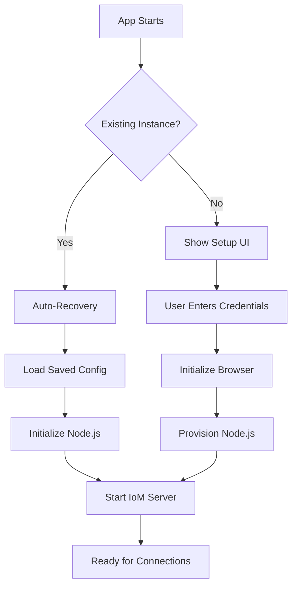

# LAMA Electron Architecture v2.0

## Overview

LAMA Electron is a desktop application that runs two separate ONE.core instances with different roles and storage mechanisms. This dual-instance architecture provides both UI responsiveness and robust data management with multi-device support.

## Core Architecture Changes (v2.0)

### Major Improvements
1. **Direct P2P Connections**: Renderer connects directly to Node.js without comm server
2. **Multi-Device Support**: Node.js acts as central hub for multiple devices
3. **Improved Attachment Handling**: Proper BLOB storage with ONE.core
4. **Flexible Connection Modes**: Support both direct and comm server connections

## Dual ONE.core Architecture

### 1. Browser Instance (Renderer Process)
- **Location**: `/electron-ui/`
- **Platform**: Browser environment with IndexedDB
- **Role**: UI responsiveness, sparse storage, real-time interactions
- **Storage**: IndexedDB (limited, fast access)
- **State**: Managed locally in browser
- **Connection**: Direct P2P to Node.js, optional comm server

### 2. Node.js Instance (Main Process) - Central Hub
- **Location**: `/main/core/`
- **Platform**: Node.js with file system
- **Role**: Central hub, archive storage, device management, network operations
- **Storage**: File system (unlimited, persistent)
- **State**: Master state, manages all device connections
- **Server**: WebSocket server on port 8765 for direct connections

## Connection Architecture (Federation)

### Federation Model
The system uses a federated architecture where each instance advertises its endpoints via OneInstanceEndpoint objects. LeuteConnectionsModule automatically discovers and connects instances.

### Three Connection Modes

#### 1. Direct P2P Connection (Local - Primary)
```
Renderer (Browser) <---> WebSocket (ws://localhost:8765) <---> Node.js Hub
```

**Benefits:**
- Ultra-low latency (<1ms)
- No external dependencies
- Works offline
- Maximum privacy
- No comm server required

**Implementation:**
- Node.js: Creates OneInstanceEndpoint advertising ws://localhost:8765
- Browser: Discovers endpoint and connects automatically
- Connection managed by LeuteConnectionsModule
- CHUM protocol handles synchronization

#### 2. Comm Server Connection (External Devices)
```
External Browser <---> Comm Server (wss://comm10.dev.refinio.one) <---> Node.js Hub
```

**Use Cases:**
- Remote access from other devices
- Browser-based clients
- NAT traversal
- Firewall bypass

#### 3. Hybrid Mode (Both - Default)
Both connections active simultaneously:
- Local renderer uses direct P2P
- External devices use comm server
- Node.js hub manages both

## Multi-Device Architecture

### Hub-and-Spoke Model
```
                    Node.js Hub (Master)
                    /        |         \
                   /         |          \
        Local Renderer   Device 1    Device 2
         (Direct P2P)   (via Comm)  (via Comm)
            |              |            |
      Instance: gecko-ui  gecko-ui-1  gecko-ui-2
```

### Device Management System

**Components:**
1. **DeviceManager** (`/main/core/device-manager.js`)
   - Registers new devices
   - Tracks connection status
   - Manages device-specific instances
   - Creates IoM invites

2. **Device Registration Flow**
   ```javascript
   // Device registration
   await deviceManager.registerDevice({
     name: "iPhone",
     platform: "ios"
   })
   // Returns: { device, invite }
   ```

3. **Unique Instance Names**
   - Hub: `gecko` (user-chosen name)
   - Local renderer: `gecko-ui`
   - Device 1: `gecko-ui-device1`
   - Device 2: `gecko-ui-device2`

4. **Device Storage**
   - Devices tracked in: `one-core-storage/devices.json`
   - Each device gets unique browser instance
   - Invites stored with device metadata

### Message Replication
```
Device A sends message
    ↓
Node.js Hub receives
    ↓
Hub stores in TopicRoom
    ↓
Hub broadcasts to all connected devices
    ↓
Devices B, C, D receive update
```

## Authentication & Initialization

### Startup Flow


### Auto-Recovery
- Node.js instance can auto-recover from saved config
- Located in: `one-core-storage/node/instance-config.json`
- Includes instance name and owner ID
- No password stored (security)

## Attachment System

### Storage Architecture
```
User selects file
    ↓
Browser stores as BLOB (temporary)
    ↓
Attachment hash generated
    ↓
Message sent with hash reference
    ↓
Node.js retrieves and stores (permanent)
    ↓
Other devices request by hash
```

### BLOB Storage Locations
- **Browser**: IndexedDB (quota-limited)
- **Node.js**: File system at `one-core-storage/node/blobs/`

### Attachment Message Format
```javascript
{
  $type$: 'ChatMessage',
  text: 'Check out this image',
  blobs: [{
    hash: 'abc123...',
    mimeType: 'image/png',
    name: 'photo.png',
    size: 12345
  }]
}
```

## Direct Connection Service

### Implementation (`/electron-ui/src/services/direct-connection.ts`)
```typescript
class DirectConnectionService {
  // Connects directly to Node.js WebSocket
  async connectToNode(): Promise<boolean>
  
  // Send messages without comm server
  async sendToNode(type: string, data: any): Promise<void>
  
  // Handle incoming sync/updates
  private handleSync(message: any): void
  private handleUpdate(message: any): void
}
```

### Message Types
- `handshake`: Initial connection setup
- `sync`: Full state synchronization
- `update`: Incremental updates
- `notification`: Real-time alerts

## IPC Communication

### Architecture
```
Renderer Process          Main Process
      ↓                        ↑
   IPC Send               IPC Handle
      ↓                        ↑
Context Bridge          IPC Controller
      ↓                        ↑
 Window API              Handler Modules
```

### Key IPC Channels
- `onecore:initializeNode`: Initialize Node.js instance
- `devices:register`: Register new device
- `devices:list`: Get connected devices
- `attachment:store`: Store attachment BLOB
- `chat:sendMessage`: Send chat message

## Configuration System

### Connection Configuration (`/electron-ui/src/config/connection-config.ts`)
```typescript
interface ConnectionConfig {
  useDirectConnection: boolean      // Enable direct P2P
  nodeEndpoint: string              // Node.js WebSocket URL
  enableCommServer: boolean         // Enable comm server
  commServerUrl?: string           // Comm server URL
  connectionPriority: 'direct' | 'commserver' | 'both'
}
```

### Environment-Based Config
- **Development**: Uses `wss://comm10.dev.refinio.one`
- **Production**: Uses `wss://comm.refinio.net`
- **Electron**: Enables both direct and comm server
- **Browser**: Comm server only

## Performance Optimizations

### Connection Latency
- Direct P2P: <1ms (local)
- Comm Server: 20-100ms (internet)
- Automatic fallback on connection failure

### Storage Optimization
- Browser: Sparse storage (recent messages)
- Node.js: Full archive (all history)
- Attachment caching with LRU eviction

### Message Batching
- Groups multiple updates
- Reduces WebSocket overhead
- Automatic flush every 100ms

## Security Model

### Context Isolation
- Renderer has no direct Node.js access
- All communication via secure IPC
- Preload script validates messages

### Connection Security
- Direct P2P: Local only (localhost)
- Comm Server: WSS (TLS encrypted)
- IoM invites: Cryptographic authentication

### Storage Security
- Encrypted credentials in keychain
- No plaintext passwords stored
- Per-device access tokens

## Debugging & Development

### Debug Flags
```javascript
// Browser console
localStorage.debug = 'lama:*'

// Environment variable
DEBUG=NodeOneCore,DeviceManager npm run electron:dev
```

### Key Log Locations
- `[NodeOneCore]`: Node.js instance logs
- `[DeviceManager]`: Device connection logs
- `[DirectConnection]`: P2P connection logs
- `[LamaBridge]`: Message handling logs

### Testing Connections
1. Check Node.js WebSocket: `ws://localhost:8765`
2. Verify comm server: `wss://comm10.dev.refinio.one`
3. Test device registration via UI
4. Monitor WebSocket frames in DevTools

## Common Issues & Solutions

### Issue: "WebSocket connection failed"
**Solution**: Ensure Node.js instance is initialized first

### Issue: "Invalid typed array length"
**Solution**: Comm server data format issue, use direct connection

### Issue: "Attachment not displaying"
**Solution**: Check BLOB storage initialization in both instances

### Issue: "Device not connecting"
**Solution**: Verify invite is valid and not expired

## Migration from v1.0

### Breaking Changes
1. IoM connection now optional
2. Device registration required for multi-device
3. Attachment format changed to use blobs array

### Upgrade Path
1. Clear old storage: `rm -rf one-core-storage/`
2. Update connection config
3. Re-register devices
4. Migrate attachments to BLOB storage

## Future Roadmap

### v2.1 - Q1 2024
- [ ] Full CHUM sync implementation
- [ ] Offline message queue
- [ ] Attachment compression

### v2.2 - Q2 2024
- [ ] UDP/QUIC transport
- [ ] Bluetooth device discovery
- [ ] End-to-end encryption

### v3.0 - Q3 2024
- [ ] Mesh networking
- [ ] Distributed storage
- [ ] Multi-hub federation

## API Reference

### DeviceManager API
```javascript
// Register device
await deviceManager.registerDevice(deviceInfo)

// List devices
deviceManager.getAllDevices()

// Get connected devices
deviceManager.getConnectedDevices()

// Send to specific device
deviceManager.sendToDevice(deviceId, message)

// Broadcast to all
deviceManager.broadcastToDevices(message)
```

### DirectConnection API
```typescript
// Connect to Node.js
await directConnection.connectToNode()

// Send message
await directConnection.sendToNode('sync', data)

// Check status
directConnection.getConnectionStatus()

// Disconnect
await directConnection.disconnect()
```

## Contributing

### Development Setup
```bash
# Install dependencies
npm install

# Run in development
npm run electron:dev

# Run tests
npm test

# Build for production
npm run electron:build
```

### Code Style
- TypeScript for renderer code
- JavaScript for main process
- ESLint configuration provided
- Prettier for formatting

### Pull Request Process
1. Update documentation
2. Add tests for new features
3. Ensure all tests pass
4. Update CHANGELOG.md
5. Submit PR with description

---

For additional details, see:
- Original architecture: `/ELECTRON-ARCHITECTURE.md`
- AI instructions: `/CLAUDE.md`
- Source code documentation: Inline comments