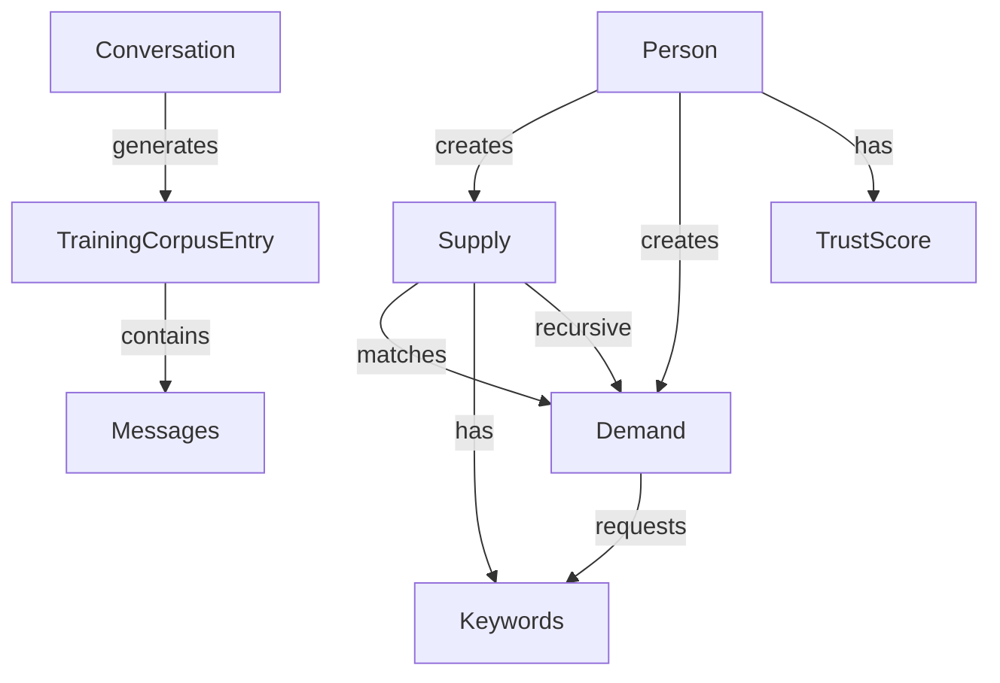

# Data Model: Feed-Forward Training Infrastructure

## Core Entities

### 1. Supply Object
**Purpose**: Declares available knowledge from conversations
**Recipe Name**: `Supply`
**Storage**: Versioned ONE object

#### Fields
| Field | Type | Required | Description |
|-------|------|----------|-------------|
| $type$ | 'Supply' | Yes | Object type identifier |
| id | string (UUID) | Yes | Unique identifier (isId: true) |
| keywords | SHA256Hash[] | Yes | Array of keyword hashes |
| contextLevel | integer | Yes | Depth of context (1-5) |
| conversationId | SHA256Hash | Yes | Reference to source conversation |
| creatorId | SHA256IdHash<Person> | Yes | Who created this supply |
| trustScore | number | Yes | Creator's trust score at creation |
| created | integer | Yes | Unix timestamp |
| metadata | object | No | Additional context data |
| isRecursive | boolean | Yes | Is this a Demand-as-Supply? |

#### Validation Rules
- keywords.length >= 1 && <= 20
- contextLevel >= 1 && <= 5
- trustScore >= 0 && <= 1
- created must be valid timestamp

### 2. Demand Object
**Purpose**: Requests for knowledge about topics
**Recipe Name**: `Demand`
**Storage**: Versioned ONE object

#### Fields
| Field | Type | Required | Description |
|-------|------|----------|-------------|
| $type$ | 'Demand' | Yes | Object type identifier |
| id | string (UUID) | Yes | Unique identifier (isId: true) |
| keywords | SHA256Hash[] | Yes | Requested keyword hashes |
| urgency | integer | Yes | Priority level (1-10) |
| context | string | Yes | Why this knowledge is needed |
| criteria | object | No | Matching criteria/filters |
| requesterId | SHA256IdHash<Person> | Yes | Who created this demand |
| created | integer | Yes | Unix timestamp |
| expires | integer | No | When demand expires |
| maxResults | integer | No | Max supply matches wanted |

#### Validation Rules
- keywords.length >= 1 && <= 10
- urgency >= 1 && <= 10
- context.length <= 500 characters
- expires > created (if set)
- maxResults > 0 && <= 100 (if set)

### 3. SupplyDemandMatch
**Purpose**: Links Supply objects to matching Demands
**Recipe Name**: `SupplyDemandMatch`
**Storage**: Unversioned ONE object

#### Fields
| Field | Type | Required | Description |
|-------|------|----------|-------------|
| $type$ | 'SupplyDemandMatch' | Yes | Object type identifier |
| demandHash | SHA256Hash<Demand> | Yes | Demand being matched |
| supplyHash | SHA256Hash<Supply> | Yes | Supply that matches |
| matchScore | number | Yes | Quality of match (0-1) |
| matchedKeywords | SHA256Hash[] | Yes | Keywords that matched |
| trustWeight | number | Yes | Trust-weighted score |
| created | integer | Yes | When match was made |

#### Validation Rules
- matchScore >= 0 && <= 1
- trustWeight >= 0 && <= 1
- matchedKeywords.length >= 1

### 4. TrustScore
**Purpose**: Tracks trust scores for participants
**Recipe Name**: `TrustScore`
**Storage**: Versioned ONE object

#### Fields
| Field | Type | Required | Description |
|-------|------|----------|-------------|
| $type$ | 'TrustScore' | Yes | Object type identifier |
| participantId | SHA256IdHash<Person> | Yes | Participant being scored (isId: true) |
| score | number | Yes | Current trust score |
| components | object | Yes | Score breakdown |
| history | array | Yes | Recent score changes |
| lastUpdated | integer | Yes | Last calculation time |
| endorsers | SHA256IdHash<Person>[] | No | Who endorses this participant |

#### Components Structure
```javascript
{
  identityVerification: 0.0-1.0,
  historicalAccuracy: 0.0-1.0,
  peerEndorsements: 0.0-1.0,
  activityConsistency: 0.0-1.0,
  accountAge: 0.0-1.0
}
```

### 5. TrainingCorpusEntry
**Purpose**: Processed conversation ready for training
**Recipe Name**: `TrainingCorpusEntry`
**Storage**: Unversioned ONE object

#### Fields
| Field | Type | Required | Description |
|-------|------|----------|-------------|
| $type$ | 'TrainingCorpusEntry' | Yes | Object type identifier |
| conversationId | SHA256Hash | Yes | Source conversation |
| messages | array | Yes | Processed messages |
| keywords | SHA256Hash[] | Yes | Extracted keywords |
| participants | object[] | Yes | Participant info with trust |
| qualityScore | number | Yes | Overall quality rating |
| created | integer | Yes | Processing timestamp |
| consumerAccess | string[] | No | API keys with access |

#### Message Structure
```javascript
{
  id: SHA256Hash,
  authorId: SHA256IdHash<Person>,
  isAI: boolean,
  content: string,  // Sanitized
  keywords: SHA256Hash[],
  timestamp: integer,
  trustScore: number
}
```

## Relationships



## State Transitions

### Supply Object States
1. **Created**: Initial state when supply is generated
2. **Active**: Available for matching
3. **Matched**: Has been matched to demand(s)
4. **Expired**: Past retention period
5. **Archived**: Moved to cold storage

### Demand Object States
1. **Created**: Initial request state
2. **Pending**: Awaiting matches
3. **Fulfilled**: Sufficient matches found
4. **Expired**: Timeout reached
5. **Cancelled**: Manually cancelled

### Trust Score States
1. **Unverified**: New participant, no history
2. **Building**: < 10 interactions
3. **Established**: 10+ interactions
4. **Trusted**: Score > 0.7
5. **Flagged**: Score < 0.3

## Indexes and Access Patterns

### Primary Indexes
- Supply.keywords (for matching)
- Demand.keywords (for matching)
- TrustScore.participantId (for lookups)
- TrainingCorpusEntry.created (for time queries)

### Common Queries
1. Find Supply by keywords: O(log n)
2. Find Demand by keywords: O(log n)
3. Get trust score for participant: O(1)
4. Get recent corpus entries: O(log n)
5. Match Supply to Demand: O(n*m) worst case

## Data Retention Policy

| Entity | Active Period | Archive Period | Deletion |
|--------|--------------|----------------|----------|
| Supply | 90 days | 1 year | On request |
| Demand | 30 days | 90 days | Automatic |
| SupplyDemandMatch | 90 days | 1 year | With Supply/Demand |
| TrustScore | Indefinite | N/A | On account deletion |
| TrainingCorpusEntry | 90 days | Indefinite* | On request |

*Anonymized after 90 days

## Privacy Considerations

### PII Handling
- Message content is sanitized before storage
- Participant IDs are hashed
- No email/name in corpus entries
- IP addresses never stored

### Consent Tracking
- Stored in Topic.sharingEnabled flag
- Default: false (private)
- Audit trail of consent changes
- Retroactive deletion supported

## Performance Targets

| Operation | Target Latency | Throughput |
|-----------|---------------|------------|
| Create Supply | < 50ms | 1000/sec |
| Create Demand | < 50ms | 100/sec |
| Match Supply/Demand | < 500ms | 10/sec |
| Calculate Trust | < 100ms | 100/sec |
| Generate Corpus Entry | < 1s | 10/sec |

## Migration Strategy
No migration needed - new entities only. Existing Keyword objects will be reused.