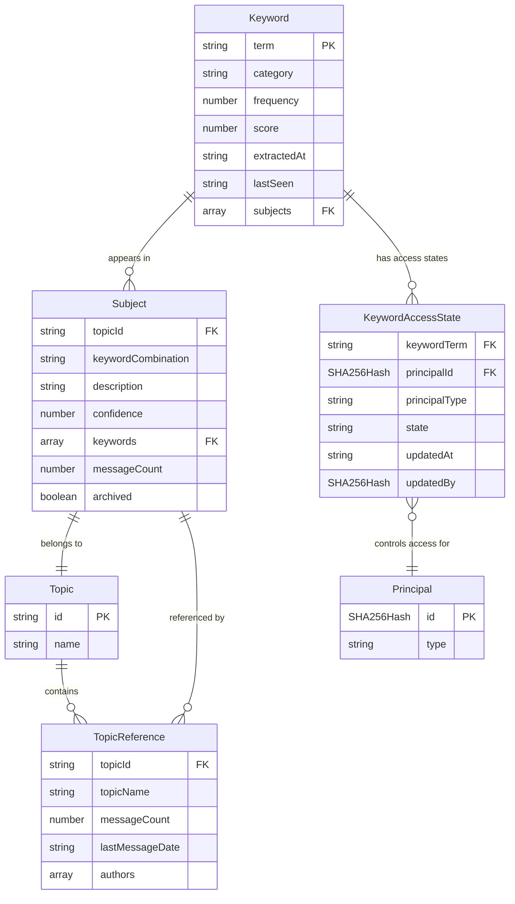
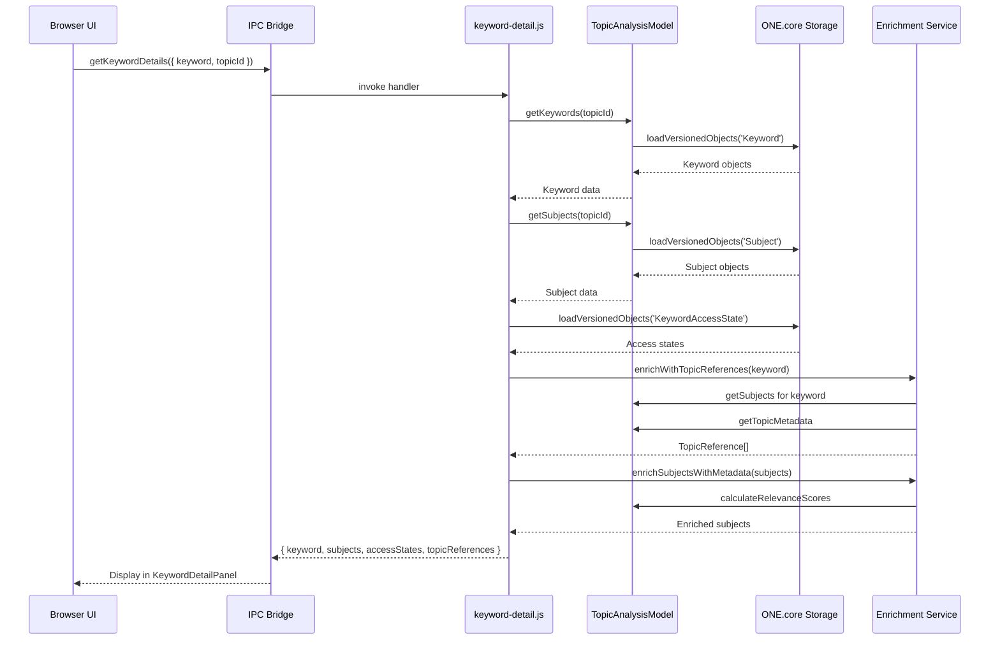
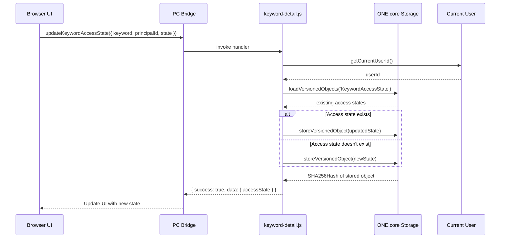

# Data Model: Keyword Detail Preview

**Feature**: 015-keyword-detail-preview
**Date**: 2025-10-01
**Status**: Phase 1 Complete

## Overview

This document defines the data model for the keyword detail preview feature. The model extends the existing `one-ai` package infrastructure with new entities for access control and enriched keyword/subject data.

## Core Principles

1. **ONE.core Storage**: All entities stored as versioned objects in ONE.core
2. **Bidirectional Relationships**: Keywords ↔ Subjects maintained consistently
3. **Fail-Fast**: No fallbacks - operations fail if data unavailable
4. **IPC-First**: All data access from UI via IPC handlers

## Entity Definitions

### KeywordAccessState

**Purpose**: Represents access control state for a user or group regarding a specific keyword.

**Storage**: ONE.core versioned object (`$type$: 'KeywordAccessState'`)

**Fields**:

| Field | Type | Required | Description |
|-------|------|----------|-------------|
| `$type$` | `'KeywordAccessState'` | Yes | ONE.core type identifier |
| `keywordTerm` | `string` | Yes | Normalized keyword text (lowercase, trimmed) |
| `principalId` | `SHA256Hash` | Yes | User or Group ID from ONE.core |
| `principalType` | `'user' \| 'group'` | Yes | Type of principal |
| `state` | `'allow' \| 'deny' \| 'none'` | Yes | Access state |
| `updatedAt` | `string` | Yes | ISO 8601 timestamp of last update |
| `updatedBy` | `SHA256Hash` | Yes | User who made the change |

**Composite Key**: `keywordTerm + principalId` (unique constraint)

**Example**:
```typescript
{
  $type$: 'KeywordAccessState',
  keywordTerm: 'blockchain',
  principalId: 'sha256:abc123...',
  principalType: 'user',
  state: 'allow',
  updatedAt: '2025-10-01T12:34:56.789Z',
  updatedBy: 'sha256:def456...'
}
```

**Relationships**:
- References `Keyword` via `keywordTerm` (denormalized for query performance)
- References ONE.core `Person` or `Group` via `principalId`

---

### Keyword (Extended)

**Purpose**: Represents an extracted term from conversation content.

**Storage**: ONE.core versioned object (`$type$: 'Keyword'`)

**Existing Fields** (from `/main/core/one-ai/models/Keyword.ts`):

| Field | Type | Description |
|-------|------|-------------|
| `$type$` | `'Keyword'` | ONE.core type identifier |
| `term` | `string` | Normalized keyword text |
| `category` | `string \| null` | Optional category |
| `frequency` | `number` | Occurrence count |
| `score` | `number` | Relevance score (0-1) |
| `extractedAt` | `string` | ISO timestamp of first extraction |
| `lastSeen` | `string` | ISO timestamp of last occurrence |
| `subjects` | `SHA256Hash<Subject>[]` | Array of subject references |

**New Fields** (enriched at runtime, NOT stored):

| Field | Type | Description |
|-------|------|-------------|
| `topicReferences` | `TopicReference[]` | List of topics where keyword appears |
| `accessStates` | `KeywordAccessState[]` | Access control states for users/groups |

**Example Enriched Response**:
```typescript
{
  $type$: 'Keyword',
  term: 'blockchain',
  category: null,
  frequency: 23,
  score: 0.85,
  extractedAt: '2025-09-15T10:00:00.000Z',
  lastSeen: '2025-10-01T09:30:00.000Z',
  subjects: ['sha256:sub1...', 'sha256:sub2...'],

  // Runtime enrichment (not stored)
  topicReferences: [
    {
      topicId: 'crypto-discussion',
      topicName: 'Crypto Discussion',
      messageCount: 15,
      lastMessageDate: '2025-10-01T09:30:00.000Z',
      authors: ['sha256:user1...', 'sha256:user2...']
    }
  ],
  accessStates: [
    {
      principalId: 'sha256:user1...',
      principalType: 'user',
      state: 'allow'
    }
  ]
}
```

**Relationships**:
- Many-to-Many with `Subject` (via `subjects` array)
- One-to-Many with `KeywordAccessState` (via `keywordTerm`)
- Referenced by multiple `TopicReference` objects (runtime)

---

### Subject (Extended)

**Purpose**: Represents a theme identified by keyword combinations in a topic.

**Storage**: ONE.core versioned object (`$type$: 'Subject'`)

**Existing Fields** (from `/main/core/one-ai/models/Subject.ts`):

| Field | Type | Description |
|-------|------|-------------|
| `$type$` | `'Subject'` | ONE.core type identifier |
| `topicId` | `string` | Topic identifier |
| `keywordCombination` | `string` | Sorted keywords joined with '+' |
| `description` | `string` | Brief description of subject |
| `confidence` | `number` | AI confidence score (0-1) |
| `keywords` | `SHA256Hash<Keyword>[]` | Array of keyword references |
| `extractedAt` | `number` | Timestamp of extraction |
| `firstSeen` | `string` | ISO timestamp of first mention |
| `lastSeen` | `string` | ISO timestamp of last mention |
| `messageCount` | `number` | Number of messages mentioning subject |
| `archived` | `boolean` | Whether subject is archived |

**New Fields** (enriched at runtime, NOT stored):

| Field | Type | Description |
|-------|------|-------------|
| `relevanceScore` | `number` | Calculated relevance (places × recency × frequency) |
| `placesMentioned` | `number` | Number of distinct topics referencing subject |
| `authors` | `SHA256Hash[]` | Users who discussed this subject |
| `sortTimestamp` | `string` | ISO timestamp for time-based sorting |

**Relevance Score Calculation**:
```typescript
relevanceScore = (placesMentioned * 10) +
                 (recencyFactor * 5) +
                 (frequency * 2)

where:
  recencyFactor = 1 / (daysSinceLastSeen + 1)
  frequency = messageCount
```

**Example Enriched Response**:
```typescript
{
  $type$: 'Subject',
  topicId: 'crypto-discussion',
  keywordCombination: 'blockchain+ethereum+smartcontract',
  description: 'Discussion about Ethereum smart contracts and blockchain technology',
  confidence: 0.9,
  keywords: ['sha256:kw1...', 'sha256:kw2...'],
  extractedAt: 1696147200000,
  firstSeen: '2025-09-15T10:00:00.000Z',
  lastSeen: '2025-10-01T09:30:00.000Z',
  messageCount: 15,
  archived: false,

  // Runtime enrichment (not stored)
  relevanceScore: 47.5,
  placesMentioned: 3,
  authors: ['sha256:user1...', 'sha256:user2...'],
  sortTimestamp: '2025-10-01T09:30:00.000Z'
}
```

**Relationships**:
- Many-to-Many with `Keyword` (via `keywords` array)
- Belongs to one `Topic` (via `topicId`)
- Referenced by messages in the topic (implicit)

---

### TopicReference (Runtime Only)

**Purpose**: Represents a reference to a topic where a keyword appears.

**Storage**: NOT stored - computed at runtime from Topic/Subject data

**Fields**:

| Field | Type | Required | Description |
|-------|------|----------|-------------|
| `topicId` | `string` | Yes | Topic identifier |
| `topicName` | `string` | Yes | Human-readable topic name |
| `messageCount` | `number` | Yes | Number of messages with keyword |
| `lastMessageDate` | `string` | Yes | ISO timestamp of last message |
| `authors` | `SHA256Hash[]` | Yes | Users who mentioned keyword in topic |

**Example**:
```typescript
{
  topicId: 'crypto-discussion',
  topicName: 'Crypto Discussion',
  messageCount: 15,
  lastMessageDate: '2025-10-01T09:30:00.000Z',
  authors: ['sha256:user1...', 'sha256:user2...']
}
```

**Derived From**:
- `Subject.topicId` - identifies the topic
- `Subject.messageCount` - message count
- `Subject.lastSeen` - last message timestamp
- Topic metadata from ChannelManager/TopicModel

---

## Entity Relationships

### ER Diagram



### Cardinality Summary

| Relationship | Cardinality | Notes |
|--------------|-------------|-------|
| Keyword → Subject | Many-to-Many | Keywords can appear in multiple subjects |
| Subject → Keyword | Many-to-Many | Subjects contain multiple keywords |
| Keyword → KeywordAccessState | One-to-Many | Each keyword has multiple access states |
| KeywordAccessState → Principal | Many-to-One | Each access state belongs to one user/group |
| Subject → Topic | Many-to-One | Subjects belong to one topic |
| Keyword → TopicReference | One-to-Many (runtime) | Derived from subjects |

---

## Data Flow

### Keyword Detail Request Flow



### Access State Update Flow



---

## Storage Patterns

### ONE.core Versioned Objects

**Storage Method**: `storeVersionedObject()` from `@refinio/one.core/lib/storage-versioned-objects.js`

**Query Method**: `loadVersionedObjects(type)` from `@refinio/one.core/lib/storage-versioned-objects.js`

**Pattern**:
```typescript
// Store
const keyword = {
  $type$: 'Keyword',
  term: 'blockchain',
  // ... other fields
};
const hash = await storeVersionedObject(keyword);

// Query
const keywords = await loadVersionedObjects('Keyword');
const filtered = keywords.filter(k => k.topicId === topicId);
```

### Access State Composite Key Pattern

**Problem**: Need to ensure one access state per keyword+principal combination

**Solution**: Query all access states, filter in memory, update or create

```typescript
async function updateAccessState(keywordTerm, principalId, state, updatedBy) {
  // Load all access states
  const allStates = await loadVersionedObjects('KeywordAccessState');

  // Find existing state
  const existing = allStates.find(s =>
    s.keywordTerm === keywordTerm &&
    s.principalId === principalId
  );

  if (existing) {
    // Update existing
    const updated = {
      ...existing,
      state,
      updatedAt: new Date().toISOString(),
      updatedBy
    };
    return await storeVersionedObject(updated);
  } else {
    // Create new
    const newState = {
      $type$: 'KeywordAccessState',
      keywordTerm,
      principalId,
      principalType: await getPrincipalType(principalId),
      state,
      updatedAt: new Date().toISOString(),
      updatedBy
    };
    return await storeVersionedObject(newState);
  }
}
```

### Caching Strategy

**Pattern**: 5-second TTL cache (matches existing `one-core.js` pattern)

```typescript
const keywordDetailsCache = new Map();
const CACHE_TTL = 5000; // 5 seconds

function getCachedKeywordDetails(keyword, topicId) {
  const key = `${keyword}:${topicId}`;
  const cached = keywordDetailsCache.get(key);

  if (cached && Date.now() - cached.timestamp < CACHE_TTL) {
    return cached.data;
  }

  return null;
}

function setCachedKeywordDetails(keyword, topicId, data) {
  const key = `${keyword}:${topicId}`;
  keywordDetailsCache.set(key, {
    data,
    timestamp: Date.now()
  });
}
```

---

## Performance Considerations

### Expected Scale

| Entity | Expected Count | Max Design |
|--------|---------------|------------|
| Keywords per topic | 15-50 | 100 |
| Subjects per keyword | 3-10 | 50 |
| Access states per keyword | 5-20 | 100 |
| Topic references per keyword | 2-5 | 20 |

### Query Optimization

1. **Batch Loading**: Load all objects of type once, filter in memory
2. **Caching**: 5-second TTL for keyword details
3. **Lazy Enrichment**: Compute TopicReference only when requested
4. **Parallel Queries**: Fetch keywords, subjects, access states in parallel

### Memory Usage

- Keyword object: ~500 bytes
- Subject object: ~1000 bytes
- Access state: ~300 bytes
- Topic reference: ~400 bytes

**Estimated peak**: 100 keywords × (500 + 10 subjects × 1000 + 20 states × 300 + 5 refs × 400) = ~350KB per topic

---

## Type Definitions (TypeScript)

```typescript
// keyword-detail.ts

import type { SHA256Hash } from '@refinio/one.core/lib/util/type-checks.js';

export interface KeywordAccessState {
  $type$: 'KeywordAccessState';
  keywordTerm: string;
  principalId: SHA256Hash;
  principalType: 'user' | 'group';
  state: 'allow' | 'deny' | 'none';
  updatedAt: string;
  updatedBy: SHA256Hash;
}

export interface TopicReference {
  topicId: string;
  topicName: string;
  messageCount: number;
  lastMessageDate: string;
  authors: SHA256Hash[];
}

export interface EnrichedKeyword {
  $type$: 'Keyword';
  term: string;
  category: string | null;
  frequency: number;
  score: number;
  extractedAt: string;
  lastSeen: string;
  subjects: SHA256Hash[];

  // Runtime enrichment
  topicReferences: TopicReference[];
  accessStates: KeywordAccessState[];
}

export interface EnrichedSubject {
  $type$: 'Subject';
  topicId: string;
  keywordCombination: string;
  description: string;
  confidence: number;
  keywords: SHA256Hash[];
  extractedAt: number;
  firstSeen: string;
  lastSeen: string;
  messageCount: number;
  archived: boolean;

  // Runtime enrichment
  relevanceScore: number;
  placesMentioned: number;
  authors: SHA256Hash[];
  sortTimestamp: string;
}

export type AccessStateValue = 'allow' | 'deny' | 'none';
export type PrincipalType = 'user' | 'group';
```

---

## Migration & Compatibility

### New Recipe Registration

Add to `/main/core/one-ai/recipes/ai-recipes.ts`:

```typescript
export const KeywordAccessState = {
  $type$: 'KeywordAccessState',
  keywordTerm: 'string',
  principalId: 'SHA256Hash',
  principalType: 'string', // 'user' | 'group'
  state: 'string', // 'allow' | 'deny' | 'none'
  updatedAt: 'string',
  updatedBy: 'SHA256Hash'
};
```

### Backward Compatibility

- **Existing Keywords**: No schema changes, enrichment happens at runtime
- **Existing Subjects**: No schema changes, enrichment happens at runtime
- **New Access States**: Separate recipe, doesn't affect existing data

---

## Validation Rules

### KeywordAccessState

- `keywordTerm`: Must match existing Keyword.term (normalized)
- `principalId`: Must reference existing Person or Group in ONE.core
- `principalType`: Must be 'user' or 'group'
- `state`: Must be 'allow', 'deny', or 'none'
- `updatedAt`: Must be valid ISO 8601 timestamp
- `updatedBy`: Must reference existing Person in ONE.core

### TopicReference (Runtime)

- `topicId`: Must match existing Topic
- `messageCount`: Must be > 0
- `lastMessageDate`: Must be valid ISO 8601 timestamp
- `authors`: Array must not be empty

---

## References

- Feature Spec: `/specs/015-keyword-detail-preview/spec.md`
- Research: `/specs/015-keyword-detail-preview/research.md`
- Plan: `/specs/015-keyword-detail-preview/plan.md`
- Existing Keyword Model: `/main/core/one-ai/models/Keyword.ts`
- Existing Subject Model: `/main/core/one-ai/models/Subject.ts`
- ONE.core Storage: `@refinio/one.core/lib/storage-versioned-objects.js`
